<div align="center">

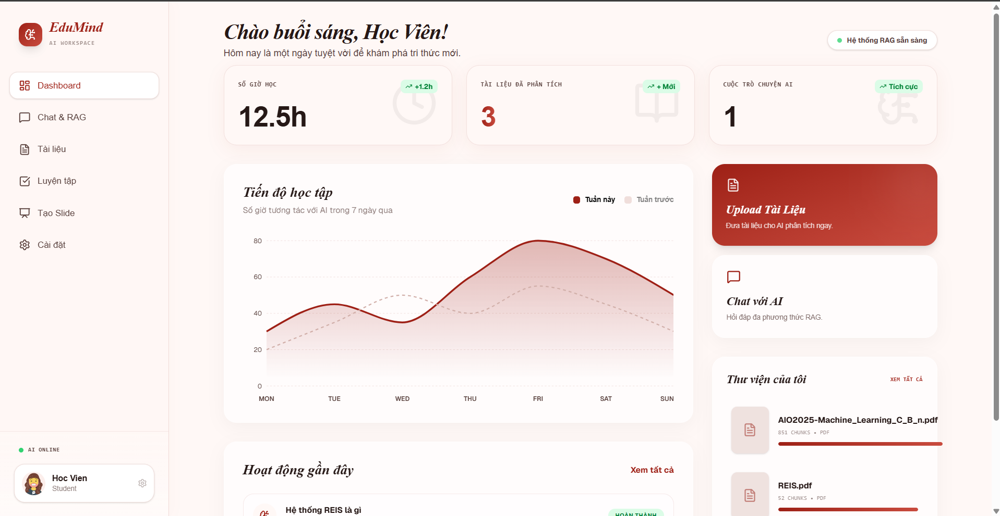

# EduMind — AI Learning Workspace

**Trợ lý học tập đa phương thức, tự chủ (Agentic) dựa trên nền tảng RAG và LangGraph.**

Hệ thống có khả năng đọc tài liệu PDF, trả lời câu hỏi kèm trích dẫn nguồn, tự động sinh bài tập trắc nghiệm với vòng lặp tự kiểm tra chất lượng (Self-Correction), giải thích sơ đồ/biểu đồ từ tài liệu, và soạn bài giảng PowerPoint hoàn chỉnh — tất cả chạy trên 100% công cụ miễn phí.

[](https://python.org)
[](https://fastapi.tiangolo.com)
[](https://langchain-ai.github.io/langgraph/)
[](https://vitejs.dev)
[](https://www.trychroma.com/)

</div>

---

## Mục lục

- [Demo giao diện](#demo-giao-diện)
- [Kiến trúc hệ thống](#kiến-trúc-hệ-thống)
- [Kết quả đánh giá (Ragas)](#kết-quả-đánh-giá-ragas)
- [Tech Stack](#tech-stack)
- [Cấu trúc thư mục](#cấu-trúc-thư-mục)
- [Cài đặt & Chạy dự án](#cài-đặt--chạy-dự-án)

---

## Demo giao diện

### 1. Dashboard — Tổng quan học tập

Dashboard cung cấp cái nhìn tổng thể: số giờ học tập, số tài liệu đã phân tích, số cuộc trò chuyện AI, biểu đồ tiến độ học tập theo tuần, và lối tắt nhanh đến các tính năng chính.


---

### 2. Smart Q&A — Advanced RAG với trích dẫn nguồn

Hỏi bất cứ điều gì từ tài liệu. Agent tự phân loại intent, kích hoạt pipeline RAG nâng cao và trả lời chính xác kèm trích dẫn trang nguồn. Mỗi câu trả lời đều có nút tắt để **Tạo Quiz** hoặc **Tạo Slide** ngay từ ngữ cảnh đó.

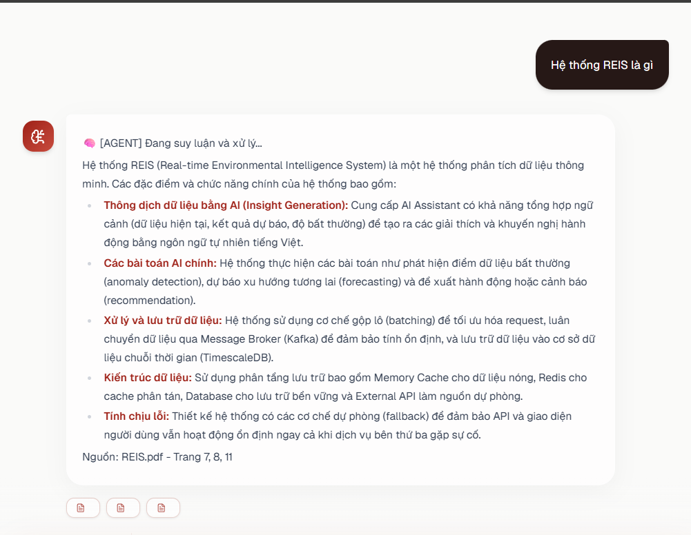

**Khả năng hiểu sơ đồ và biểu đồ trong tài liệu (Multimodal):**

Khi người dùng hỏi về một hình ảnh cụ thể trong tài liệu (ví dụ: "Giải thích sơ đồ hình 2, so sánh KNN và K-means"), hệ thống nhận diện ngữ cảnh hình ảnh đó và trả lời bằng ngôn ngữ tự nhiên đầy đủ, kèm bảng so sánh:

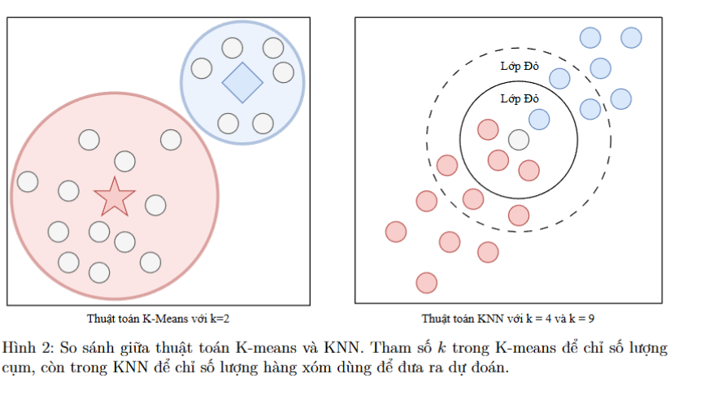
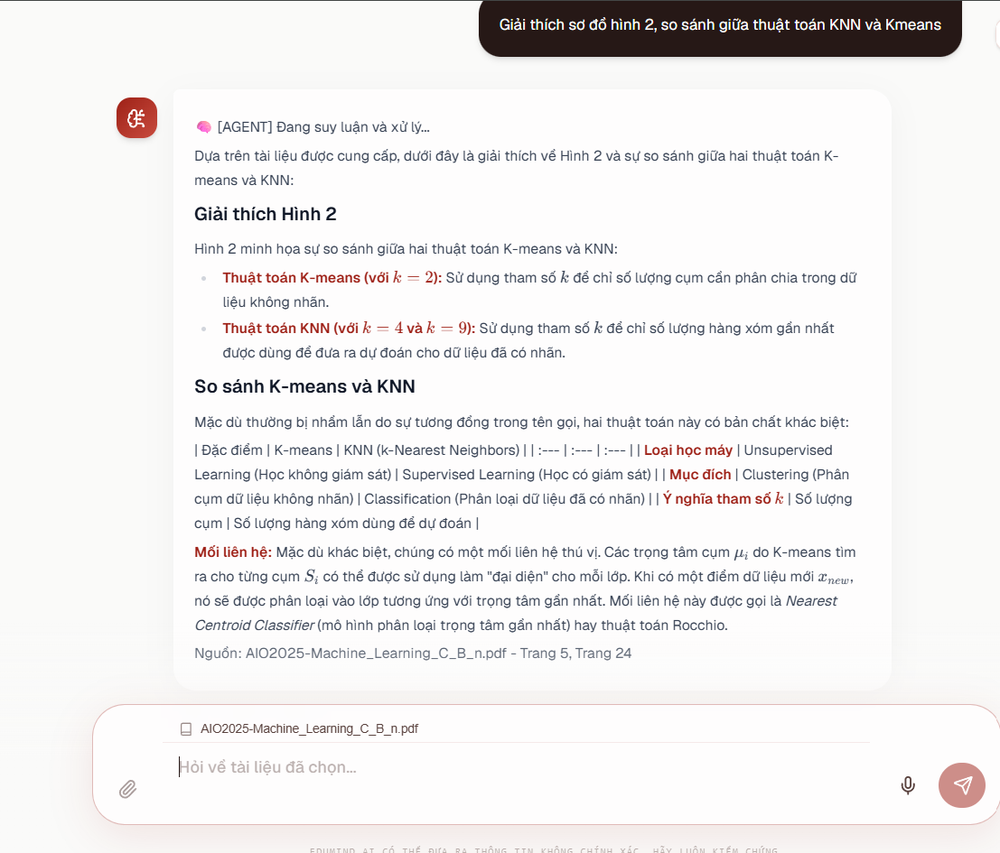

**Lịch sử hội thoại được lưu trữ và quản lý:**

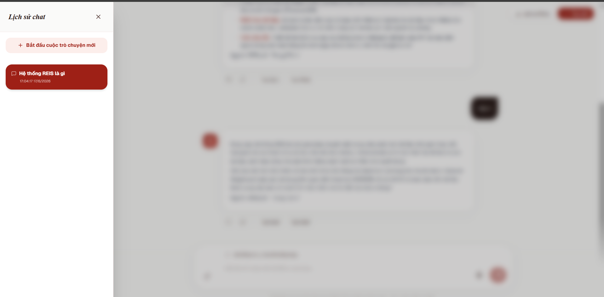

---

### 3. Hành vi an toàn — Từ chối câu hỏi ngoài phạm vi

Agent được thiết kế để **không hallucinate**. Khi người dùng hỏi về chủ đề không có trong tài liệu, hệ thống từ chối trả lời và gợi ý người dùng hỏi đúng phạm vi — thay vì bịa đặt câu trả lời.

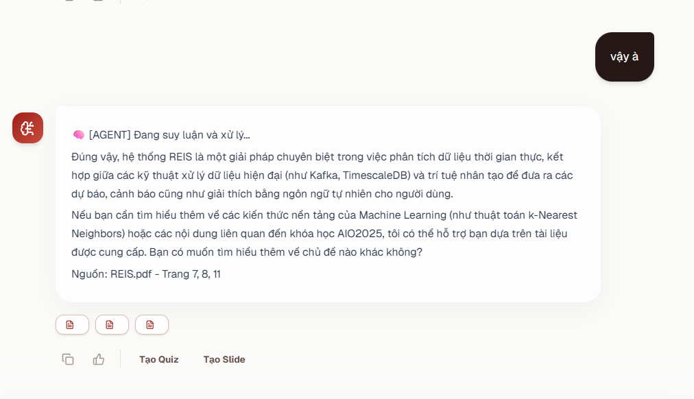

---

### 4. Agentic Quiz Generator với Self-Correction Loop

Đây là tính năng trung tâm, được xây dựng trên **LangGraph StateGraph**.

**Trang Luyện tập** — Cấu hình bài kiểm tra với độ khó và số câu tùy chỉnh:

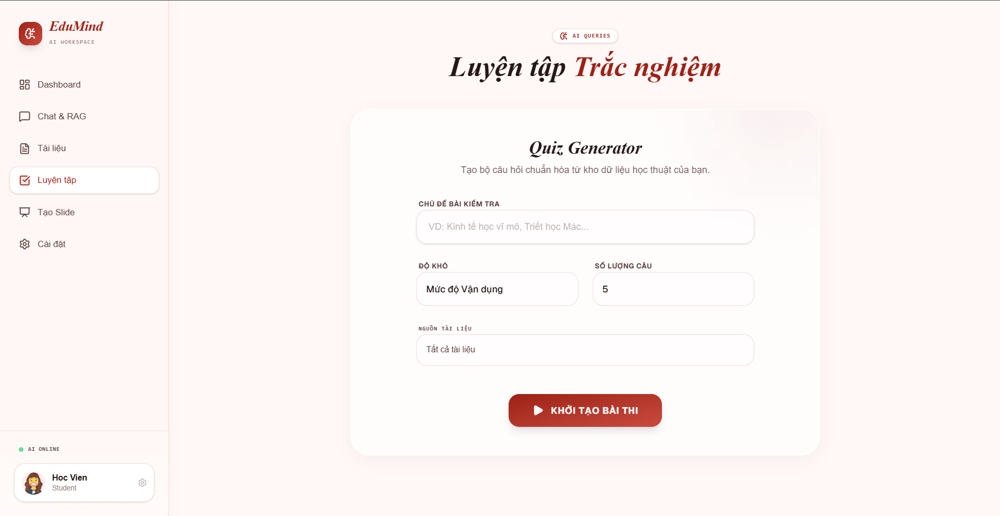

**Kết quả Quiz sinh từ Agent** — Bộ câu hỏi đã qua vòng kiểm duyệt AI:

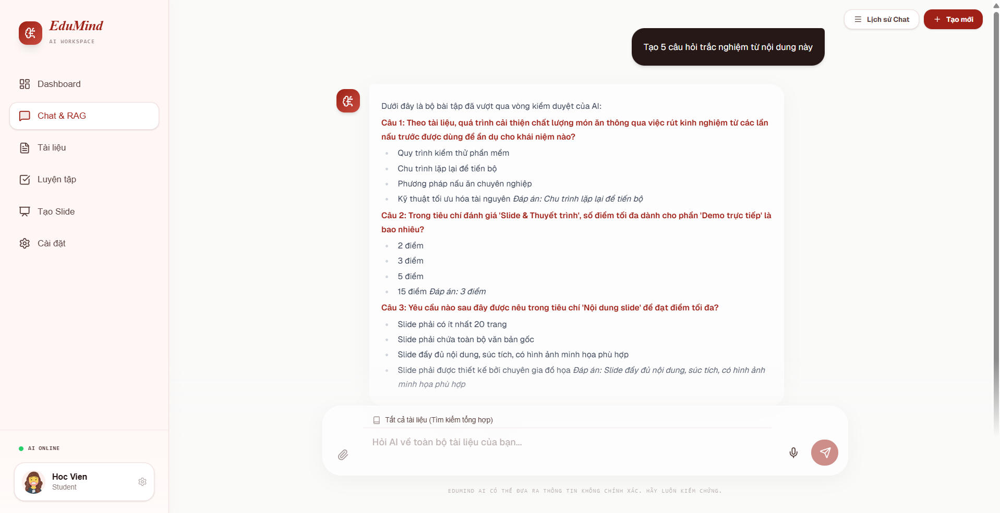

**Log quá trình Self-Correction trong terminal** — Minh chứng Agent tự suy luận, tự nhận sai và sinh lại:

```
[AGENT] Đang suy luận ý định...
[AGENT] Đang sinh bài tập... (Lần 1)
[AGENT] Đang gọi Giám khảo AI chấm điểm câu hỏi...
[GIÁM KHẢO] Tổng điểm: 10/20
[AGENT] Điểm quá thấp, quyết định: SINH LẠI BÀI TẬP!
[AGENT] Đang sinh bài tập... (Lần 2)
[AGENT] Đang gọi Giám khảo AI chấm điểm câu hỏi...
[GIÁM KHẢO] Tổng điểm: 10/20
[AGENT] Đã thử 3 lần vẫn kém, trả về kết quả tốt nhất có thể.
```

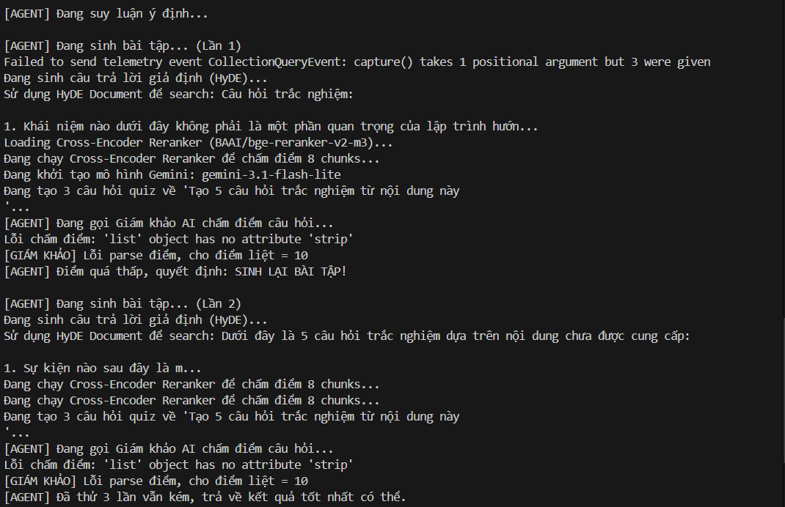

**Log pipeline RAG** — Toàn bộ quá trình từ HyDE đến Reranker đến Gemini:

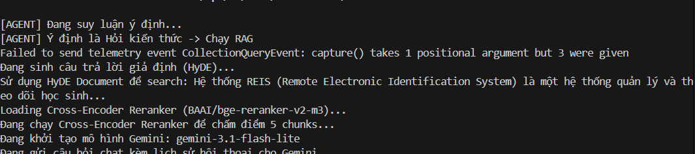

---

### 5. Auto Slide Generator

Nhập chủ đề, chọn số lượng slide và loại nội dung (Học thuật / Tóm tắt). AI trích xuất thông tin từ tài liệu, cấu trúc nội dung và xuất file `.pptx` hoàn chỉnh.

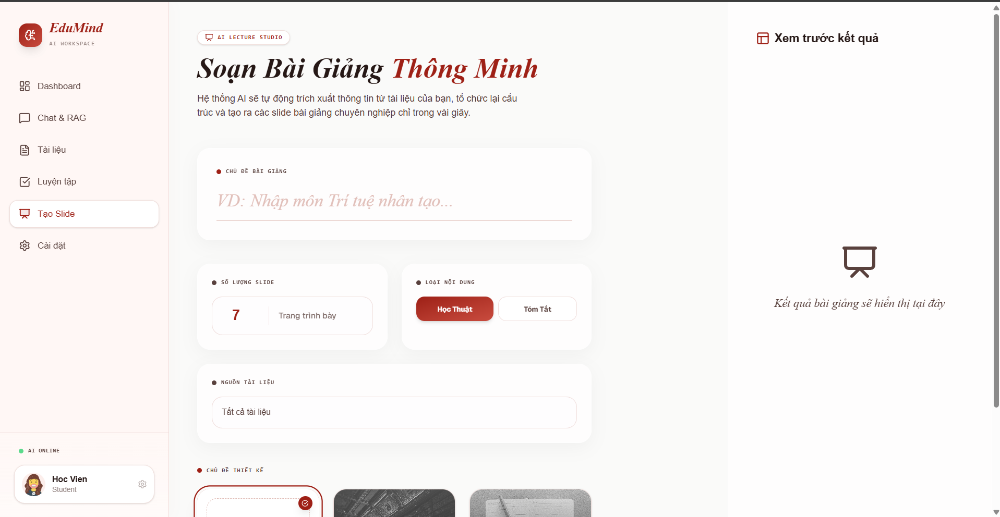

---

### 6. Thư viện Tài liệu

Upload và quản lý tài liệu học tập. Hỗ trợ PDF, DOCX, TXT. Hiển thị trạng thái xử lý và số lượng chunks được tạo ra.

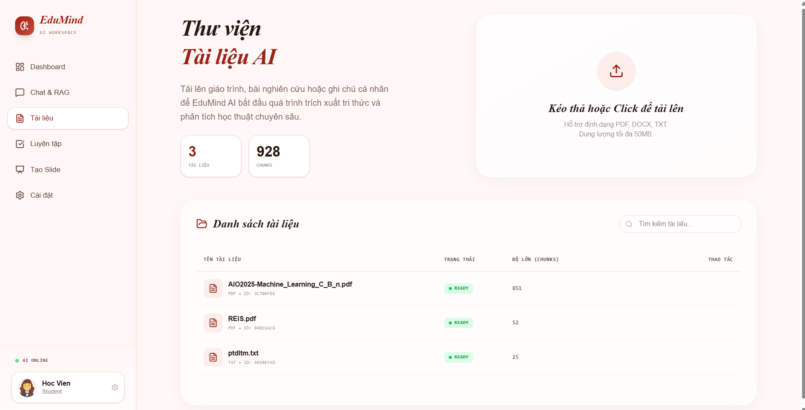

---

### 7. Cài đặt Workspace

Cấu hình profile cá nhân, nguồn tài liệu mặc định, theme slide, độ khó quiz, và quyền riêng tư (lưu/không lưu lịch sử chat).

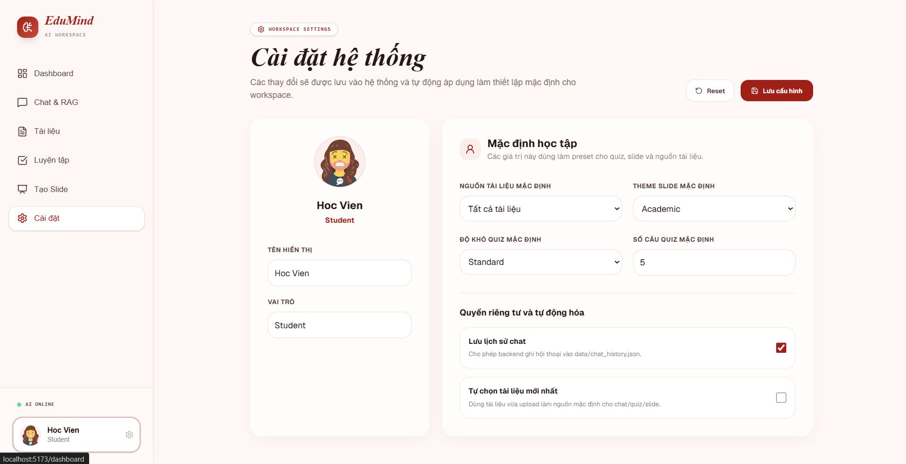

---

## Kiến trúc hệ thống

### Agentic Workflow (LangGraph StateGraph)


Toàn bộ luồng xử lý được điều phối bởi một `StateGraph` với các node chuyên biệt:

```
Người dùng gửi tin nhắn
       │
       ▼
  [router_node]             ← Phân tích intent: Quiz hay RAG?
       │
   ┌───┴────────────────────┐
   ▼                        ▼
[rag_node]          [generate_quiz_node]
   │                        │
   │                 [evaluate_quiz_node]  ← LLM-as-a-Judge (Groq Llama 3)
   │                        │               Chấm điểm 4 chiều (0–20 điểm)
   │                   Score < 15
   │                   và < 3 lần? ──Yes──► quay lại [generate_quiz_node]
   │                        │ No
   └──────────────────────[END]
```

### Advanced RAG Pipeline

```
Câu hỏi người dùng
       │
       ▼
  [HyDE Generator]         ← Gemini sinh "tài liệu giả định" để mở rộng query
       │
       ▼
  [Hybrid Retriever]        ← BM25 Keyword + Dense Vector Search (ChromaDB)
       │
       ▼
  [Cross-Encoder Reranker]  ← BAAI/bge-reranker-v2-m3 chấm điểm lại toàn bộ
       │
       ▼
  [Gemini Generator]        ← Sinh câu trả lời + trích dẫn nguồn trang
```

---

## Đánh giá Hiệu năng Hệ thống

Hệ thống được đánh giá qua 2 vòng khắt khe (Đánh giá độc lập tầng Tìm kiếm và Đánh giá Toàn trình) trên bộ câu hỏi chuyên ngành Môi trường (REIS).

### 1. Đánh giá Tầng Tìm kiếm (Retrieval Evaluation)

Đo lường bằng các chỉ số Toán học truyền thống (Information Retrieval Metrics):

| Cấu trúc Tìm kiếm                        | Hit Rate@5 | Recall@5  |   MRR@5   |
| :--------------------------------------- | :--------: | :-------: | :-------: |
| Base RAG (Chỉ Dense)                     |   0.533    |   0.433   |   0.372   |
| **Hybrid RAG (BM25: 0.4 / Dense: 0.6)**  | **0.666**  | **0.533** | **0.393** |
| Advanced RAG v1 (Dense + HyDE + Rerank)  |   0.600    |   0.500   |   0.287   |
| Advanced RAG v2 (Hybrid + HyDE + Rerank) |   0.600    |   0.466   |   0.287   |

> **Nhận xét:** Hệ thống Hybrid (kết hợp BM25 tỷ trọng 0.4 và Dense 0.6) cho thấy sự áp đảo hoàn toàn khi đẩy Hit Rate từ 53.3% lên mức đỉnh **66.6%**. Đáng chú ý, mô hình Cross-Encoder (`bge-reranker-v2-m3`) gặp hiện tượng "Domain Mismatch" (thiếu từ vựng chuyên ngành Môi trường tiếng Việt), vô tình đánh tụt hạng các tài liệu chứa từ khóa hiếm, làm MRR tụt xuống 0.287. Do đó, nhóm quyết định **loại bỏ tầng Reranker** ở hệ thống Production để tối ưu tốc độ và độ chính xác.

### 2. Đánh giá Toàn trình (End-to-End Evaluation bằng Ragas)

Đo lường chất lượng Câu trả lời cuối cùng bằng LLM-as-a-judge (Gemini 1.5 Flash):

| Phiên bản RAG                          | Faithfulness (Độ trung thực) | Answer Relevancy (Độ bám sát câu hỏi) | Context Precision (Tỷ lệ tín hiệu/nhiễu) | Context Recall (Độ bao phủ) |
| :------------------------------------- | :--------------------------: | :-----------------------------------: | :--------------------------------------: | :-------------------------: |
| Basic (Chỉ Dense)                      |            0.9214            |              **0.9422**               |                  0.7278                  |           0.7333            |
| **Advanced 1 (Dense + HyDE + Rerank)** |          **0.9782**          |                0.9310                 |                **0.8778**                |           0.7333            |
| Advanced 2 (Hybrid + HyDE + Rerank)    |            0.9667            |                0.8727                 |                  0.8556                  |           0.7333            |

> **Nhận xét:** Việc LLM (HyDE) mở rộng câu hỏi đã giúp cải thiện điểm Tín hiệu/Nhiễu (Context Precision) từ 72.7% lên tới mức kỷ lục **87.7%** ở bản Advanced 1. Mặc dù Advanced 2 được trang bị cả Hybrid, nhưng việc lôi lên các tài liệu nhiễu từ khóa đã khiến Reranker không xử lý triệt để, kéo lùi nhẹ điểm Relevancy và Precision. Nhờ tài liệu đầu vào sạch sẽ từ Advanced 1, AI sinh ra câu trả lời gần như không có sự bịa đặt (Hallucination), đẩy điểm trung thực (Faithfulness) chạm nóc **97.8%**.

---

## Tech Stack

| Layer                         | Công nghệ                                                    |
| :---------------------------- | :----------------------------------------------------------- |
| **Core AI Framework**         | LangChain + LangGraph (Agentic Workflow)                     |
| **LLM — Chat & Quiz & Slide** | Google Gemini 1.5 Flash (Free Tier)                          |
| **LLM-as-a-Judge**            | Groq Llama 3.3-70b (Đánh giá chất lượng Quiz)                |
| **Embedding**                 | `BAAI/bge-m3` — chạy local, tối ưu tiếng Việt                |
| **Reranker**                  | `BAAI/bge-reranker-v2-m3` — Cross-Encoder                    |
| **Vector Database**           | ChromaDB (Local, Persistent)                                 |
| **Backend API**               | FastAPI + Uvicorn                                            |
| **Frontend UI**               | React 18 (Vite) + Tailwind CSS                               |
| **PDF Processing**            | PyMuPDF (`fitz`) — giữ nguyên công thức, bảng biểu, hình ảnh |
| **Slide Export**              | `python-pptx`                                                |
| **Speech-to-Text**            | OpenAI Whisper (Voice Chat)                                  |
| **Evaluation**                | Ragas Framework                                              |

---

## Cấu trúc thư mục

```text
multimodel_e_learning/
├── backend/
│   ├── agent/                   # 🧠 LangGraph Agentic Core
│   │   ├── state.py             # AgentState schema (TypedDict)
│   │   ├── nodes.py             # router, rag, generate_quiz, evaluate_quiz nodes
│   │   └── graph.py             # StateGraph compilation & conditional edges
│   ├── rag/
│   │   ├── retriever.py         # HyDE + Hybrid Search + Cross-Encoder Reranker
│   │   ├── generator.py         # Gemini answer generator (stream & non-stream)
│   │   └── memory.py            # Conversation history (JSON persistence)
│   ├── quiz/
│   │   ├── quiz_generator.py    # Quiz generation với Pydantic output parser
│   │   └── evaluator.py         # LLM-as-a-Judge: 4-dimension scoring
│   ├── ingestion/
│   │   ├── pdf_parser.py        # PyMuPDF: parse text, bảng, công thức
│   │   └── chunker.py           # RecursiveCharacterTextSplitter
│   ├── slides/
│   │   └── slide_generator.py   # RAG-powered content → python-pptx export
│   ├── db/
│   │   └── vector_store.py      # ChromaDB init & collection management
│   ├── voice/
│   │   └── transcriber.py       # Whisper Speech-to-Text
│   ├── api/routers/             # FastAPI endpoints: chat, quiz, slides, documents...
│   └── main.py                  # Application entrypoint
├── frontend/                    # React 18 + Vite + Tailwind CSS
│   └── src/pages/               # Dashboard, Chat, Documents, Quiz, Slides, Settings
├── notebooks/                   # Jupyter notebooks — thực nghiệm & đánh giá
│   ├── 01_test_pdf_parser.ipynb
│   ├── 02_test_rag_pipeline.ipynb
│   ├── 03_evaluate_rag.ipynb
│   └── 06_agentic_workflow.ipynb  # Visualize LangGraph bằng draw_mermaid_png()
├── data/
│   ├── raw/                     # File PDF/TXT gốc
│   └── eval/datasets/           # Tập câu hỏi đánh giá (easy/medium/hard)
├── reports/                     # Screenshots thực tế & kết quả thực nghiệm
├── requirements.txt
└── .env                         # API Keys (không commit lên Git)
```

---

## Cài đặt & Chạy dự án

### Yêu cầu hệ thống

- Python **3.11+**
- Conda (Miniconda hoặc Anaconda)
- Node.js **18+** và npm

### Bước 1 — Clone repository

```bash
git clone <link-github-cua-nhom>
cd multimodel_e_learning
```

### Bước 2 — Tạo và kích hoạt môi trường Conda

```bash
conda create -n elearning python=3.11 -y
conda activate elearning
```

### Bước 3 — Cài đặt dependencies

```bash
pip install -r requirements.txt
```

### Bước 4 — Cấu hình biến môi trường

Tạo file `.env` ở thư mục gốc:

```env
# Bắt buộc — lấy miễn phí tại https://aistudio.google.com/
GEMINI_API_KEY=your_gemini_api_key_here

# Tùy chọn — dùng cho Quiz Evaluation, lấy miễn phí tại https://console.groq.com/
GROQ_API_KEY=your_groq_api_key_here
```

### Bước 5 — Cài đặt Frontend

```bash
cd frontend
npm install
cd ..
```

### Chạy dự án

Mở **2 terminal** song song (cả 2 đều `conda activate elearning`):

**Terminal 1 — Backend (FastAPI):**

```bash
python -m uvicorn backend.main:app --reload
```

→ API: `http://localhost:8000` | Swagger: `http://localhost:8000/docs`

**Terminal 2 — Frontend (React):**

```bash
cd frontend && npm run dev
```

→ Giao diện: `http://localhost:5173`

### Bắt đầu sử dụng

1. Mở `http://localhost:5173` → vào **Tài liệu** → Upload file PDF/TXT
2. Chờ trạng thái chuyển sang `READY`
3. Vào **Chat & RAG** → Hỏi đáp với AI
4. Thử: `"Tạo 3 câu trắc nghiệm từ tài liệu"` để kích hoạt Agentic Quiz Generator

---

## Notebooks

| Notebook                     | Mục đích                                         |
| :--------------------------- | :----------------------------------------------- |
| `01_test_pdf_parser.ipynb`   | Kiểm tra chất lượng parse PDF                    |
| `02_test_rag_pipeline.ipynb` | Test end-to-end RAG pipeline                     |
| `03_evaluate_rag.ipynb`      | Ragas evaluation — so sánh Basic vs Advanced RAG |
| `06_agentic_workflow.ipynb`  | Visualize LangGraph StateGraph + test agent      |

---

<div align="center">

_Dự án được xây dựng hoàn toàn với công cụ và API miễn phí._
_Thiết kế để dễ đọc, dễ mở rộng — phù hợp cho mục đích nghiên cứu và học thuật._

</div>
