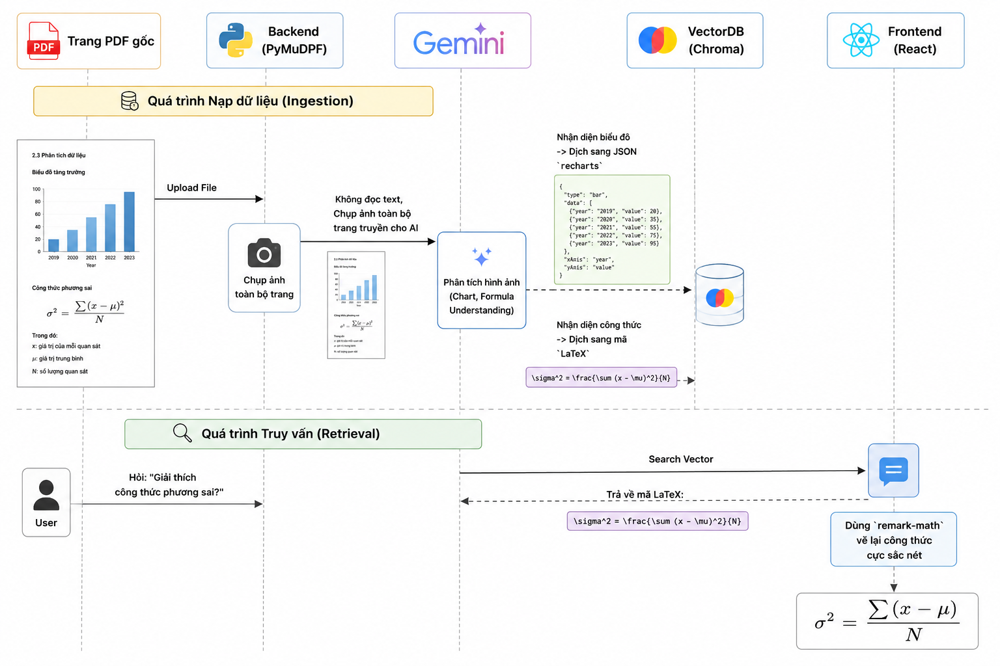
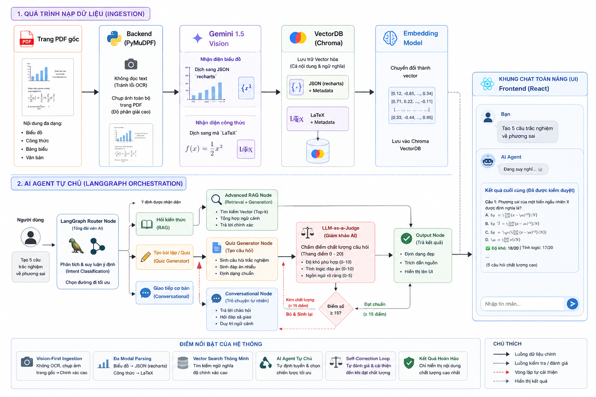

# E-Learning AI Assistant

> Một trợ lý học tập đa phương thức (Multimodal RAG) hỗ trợ sinh viên học tập thông qua PDF và hình ảnh, nổi bật với khả năng **tự động sinh Slide bài giảng (PowerPoint)** dựa trên nội dung tài liệu.

Dự án này sử dụng 100% công cụ và API miễn phí, được thiết kế dễ đọc, dễ hiểu, phù hợp cho mục đích làm đồ án môn học.

---

## Tính năng cốt lõi

1. **Smart Q&A (RAG):** Đọc file PDF (giáo trình) và trả lời câu hỏi chính xác kèm trích dẫn nguồn (ví dụ: _Nguồn: chuong_1.pdf - Trang 15_).
2. **Multimodal Vision:** Hiểu hình ảnh (sơ đồ, bài toán, biểu đồ) do người dùng tải lên nhờ sức mạnh của mô hình Vision.
3. **Auto Slide Generator:** Tính năng đặc trưng nhất. Nhập chủ đề, chọn Lớp (VD: Lớp 12) & Mức độ (VD: Nâng cao), AI sẽ tự động:
   - Dò tìm thông tin trong tài liệu.
   - Sinh nội dung và xuất ra file **.pptx** (Standard Mode).
   - Hoặc xuất ra truyện tranh 4 ô **.png** (Visual Story Mode).
4. **Quiz Generator:** Tự động tạo câu trắc nghiệm (MCQ) từ tài liệu để ôn tập và có Giám khảo AI tự động chấm điểm.

---

## Cơ chế hoạt động Multimodal Vision RAG (Toán học & Biểu đồ)

Khác với các hệ thống RAG truyền thống bị "mù" khi gặp ảnh và làm vỡ định dạng công thức Toán học, hệ thống xử lý trơn tru nhờ **Thị giác máy tính (Computer Vision)**:



---

## Kiến trúc Trợ lý Tự chủ (Agentic Router) & Tự sửa lỗi (Self-Correction)



Hệ thống sử dụng **LangChain** và **LangGraph** để biến đổi từ một Chatbot RAG thụ động thành một **AI Agent** tự chủ. Agent có khả năng:
1. **Định tuyến (Routing):** Tự động phân loại câu hỏi của người dùng để quyết định gọi luồng (Node) tạo Quiz, luồng RAG hay luồng Giao tiếp.
2. **Tự sửa lỗi (Self-Correction):** Sau khi tạo Quiz, hệ thống tự gọi Giám khảo AI (LLM-as-a-judge) chấm điểm. Nếu câu hỏi dưới chuẩn, Agent sẽ kích hoạt vòng lặp tự động sửa lỗi và sinh lại.

---

## Kết quả đánh giá hệ thống (Ragas Evaluation)

Hệ thống đã được kiểm thử và đánh giá tự động bằng framework **Ragas** trên tập dữ liệu nội bộ (16 câu hỏi). Kết quả cho thấy rõ sự đánh đổi (Trade-off) khi nâng cấp từ kiến trúc Cơ bản lên Nâng cao:

| Tiêu chí              | Basic RAG (Vector Search) | Advanced RAG (BM25 + Cross-Encoder Reranker) | Phân tích                                                                                                                    |
| :-------------------- | :-----------------------: | :------------------------------------------: | :--------------------------------------------------------------------------------------------------------------------------- |
| **Context Precision** |         `0.6204`          |                   `0.7222`                   | **Tăng mạnh (16.4%)**: Reranker hoạt động xuất sắc, đẩy chính xác các đoạn văn bản liên quan nhất lên top đầu, lọc bỏ nhiễu. |
| **Context Recall**    |         `0.6667`          |                   `0.6000`                   | **Giảm nhẹ**: Reranker lọc quá gắt, đôi khi vô tình gạt bỏ một số đoạn văn chứa ngữ cảnh bổ trợ gián tiếp.                   |
| **Faithfulness**      |         `0.6458`          |                   `0.6654`                   | **Tăng**: Nhờ chất lượng đầu vào (Precision) sạch hơn, LLM giảm tỷ lệ "ảo giác" (hallucination) và bám sát tài liệu tốt hơn. |

> **Kết luận từ thực nghiệm:** Advanced RAG không phải "viên đạn bạc". Với các tác vụ truy xuất từ khóa đơn giản, Basic RAG cho độ phủ (Recall) tốt hơn. Advanced RAG chỉ thực sự tỏa sáng ở khía cạnh Độ chính xác (Precision) và giảm thiểu Ảo giác (Faithfulness) ở những câu hỏi phức tạp.

---

## Công nghệ sử dụng (Tech Stack)

- **Ngôn ngữ:** Python 3.11+
- **Core AI Framework:** LangChain & LangGraph (Agentic Workflow)
- **Backend API:** FastAPI
- **Frontend UI:** React (Vite) + Tailwind CSS
- **LLM & Vision:** Google Gemini 1.5 Flash (Free Tier) / Groq Llama 3
- **Vector Database:** ChromaDB (Local)
- **Embedding:** `BAAI/bge-m3` (Chạy local, hỗ trợ tiếng Việt cực tốt)
- **Xử lý PDF/Slide:** `PyMuPDF` (đọc PDF), `python-pptx` (xuất file PowerPoint).

---

## Cấu trúc thư mục

```text
elearning-ai/
├── backend/                 # Xử lý logic chính
│   ├── ingestion/           # Parse PDF & Hình ảnh thành text
│   ├── rag/                 # Logic search và chat LLM
│   ├── slides/              # Logic sinh slide & render .pptx
│   ├── models/              # Các Pydantic Schema
│   └── main.py              # File chạy FastAPI Server
├── frontend/
│   └── app.py               # File chạy Streamlit UI
├── data/                    # Nơi chứa data local
│   ├── raw/                 # PDF gốc
│   ├── processed/           # Text chunks cache
│   └── slides/              # Slide xuất ra
├── notebooks/               # Chứa file .ipynb để test trực quan AI/RAG
├── docs/                    # Chứa tài liệu, file kế hoạch và kiến trúc
├── templates/               # (Tùy chọn) Chứa mẫu .pptx đẹp
└── .env                     # Chứa API Key bảo mật
```

---

## Hướng dẫn cài đặt

Yêu cầu hệ thống: Máy đã cài đặt **Conda** (Miniconda hoặc Anaconda) và **Git**.

### Bước 1: Clone dự án

Mở terminal/cmd (hoặc Anaconda Prompt) và chạy lệnh:

```bash
git clone <link-github-cua-nhom>
cd multimodel_e_learning
```

### Bước 2: Tạo môi trường ảo với Conda

Tạo một môi trường Python 3.11 riêng biệt cho dự án:

```bash
conda create -n elearning_env python=3.11 -y
```

**Kích hoạt môi trường ảo:**

```bash
conda activate elearning_env
```

_(Lưu ý: Bạn phải thấy chữ `(elearning_env)` xuất hiện ở đầu dòng lệnh mới là thành công)._

### Bước 3: Cài đặt thư viện

```bash
pip install -r requirements.txt
```

### Bước 4: Khởi tạo biến môi trường (.env)

1. Tạo một file tên là `.env` ở ngay ngoài cùng thư mục dự án (ngang hàng với `requirements.txt`).
2. Mở file `.env` lên và dán dòng này vào:

```env
GEMINI_API_KEY=điền_key_của_bạn_vào_đây
```

_(Bạn có thể lấy key miễn phí tại [Google AI Studio](https://aistudio.google.com/))._

---

## Cách chạy dự án

Hệ thống có 2 phần tách biệt: Backend (API) và Frontend (Giao diện). Bạn cần mở **2 cửa sổ Terminal** riêng biệt. Nhớ `activate` môi trường ảo ở cả 2 cửa sổ.

**Terminal 1: Chạy Backend (FastAPI)**

```bash
uvicorn backend.main:app --reload
```

👉 Backend sẽ chạy tại: `http://localhost:8000` (Bạn có thể vào `http://localhost:8000/docs` để xem API Swagger).

**Terminal 2: Chạy Frontend (Streamlit)**

```bash
streamlit run frontend/app.py
```

👉 Giao diện sẽ tự động mở lên trên trình duyệt tại: `http://localhost:8501`.

---

_Lưu ý: Mọi code push lên Git sẽ không bao gồm thư mục `venv/` và file `.env` để bảo vệ API key của bạn._
