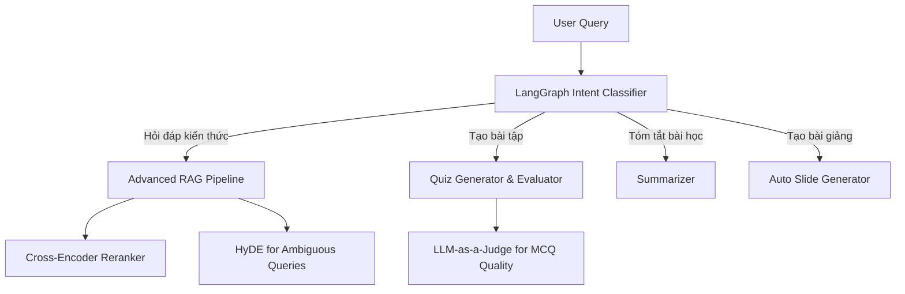

# Bản Thiết Kế Kiến Trúc: Multi-Modal E-Learning Agentic Workflow

Bản thiết kế này đánh dấu bước ngoặt chiến lược: Tạm gác lại hệ thống giám sát môi trường (REIS) để tập trung 100% hỏa lực vào dự án **Multi-Modal E-Learning**. Đây là một hệ thống EdTech AI toàn diện với lõi là **LangGraph Agentic Workflow**.

## Tầm nhìn Hệ thống (System Vision)

Thay vì một Chatbot RAG hỏi-đáp đơn thuần, chúng ta xây dựng một **Learning Assistant (Trợ lý học tập)** có khả năng định tuyến (Routing) thông minh dựa trên ý định của học sinh.

Quy trình hoạt động:

## Lộ trình Triển khai (Roadmap)

Dự án sẽ được chia thành các Phase thực thi rõ ràng để tối đa hóa điểm nhấn trong CV AI Engineer:

### Phase 1: Nâng cấp Lõi Advanced RAG (Current Focus)
- Vì E-Learning có rất nhiều câu hỏi dạng diễn giải ("Hãy giải thích cho tôi...", "Cái này nghĩa là sao..."), chúng ta **SẼ TRIỂN KHAI HyDE** và **Cross-Encoder Reranker** để AI tìm kiếm ngữ nghĩa tốt hơn thay vì chỉ tìm từ khóa.

### Phase 2: Hệ thống Sinh và Chấm điểm Trắc nghiệm (Quiz Generation & Evaluation)
- Xây dựng module dùng LLM đọc tài liệu và sinh ra câu hỏi trắc nghiệm (MCQ).
- Xây dựng một LLM-as-a-Judge khác (Dùng Groq cho rẻ/nhanh) để tự động "chấm điểm" chất lượng của các câu hỏi MCQ vừa sinh ra (Distractor Quality, Answer Correctness).

### Phase 3: Agentic Router với LangGraph
- Đưa tất cả các tính năng vào một State Graph (LangGraph).
- AI tự động nhận diện câu hỏi: Nếu user gõ *"Tạo cho em 5 câu trắc nghiệm"* -> Nhảy vào node Quiz. Nếu gõ *"Giảng lại phần này"* -> Nhảy vào node RAG.

### Phase 4: Auto Slide Generation (Bonus "Wow" Factor)
- Trích xuất ý chính (Outline) và dùng `python-pptx` để tự động render ra file PowerPoint có sẵn template.

## Verification Plan
1. **Ragas Evaluation:** Đo lường Faithfulness và Context Recall cho nhánh QA.
2. **LangSmith / Phoenix:** Tích hợp để log lại toàn bộ Agentic Workflow (Tracing) và đánh giá chất lượng tự động hàng đêm (Nightly Evaluation).

> [!IMPORTANT]
> User Review Required: 
> Bạn có đồng ý chốt hạ "Siêu kiến trúc" E-Learning này không? Nếu đồng ý, việc đầu tiên chúng ta làm ngay bây giờ là nâng cấp Lõi RAG (Phase 1) bằng cách code tính năng **HyDE và Reranker** vào file `retriever.py` để làm nền tảng vững chắc cho cả hệ thống nhé!
